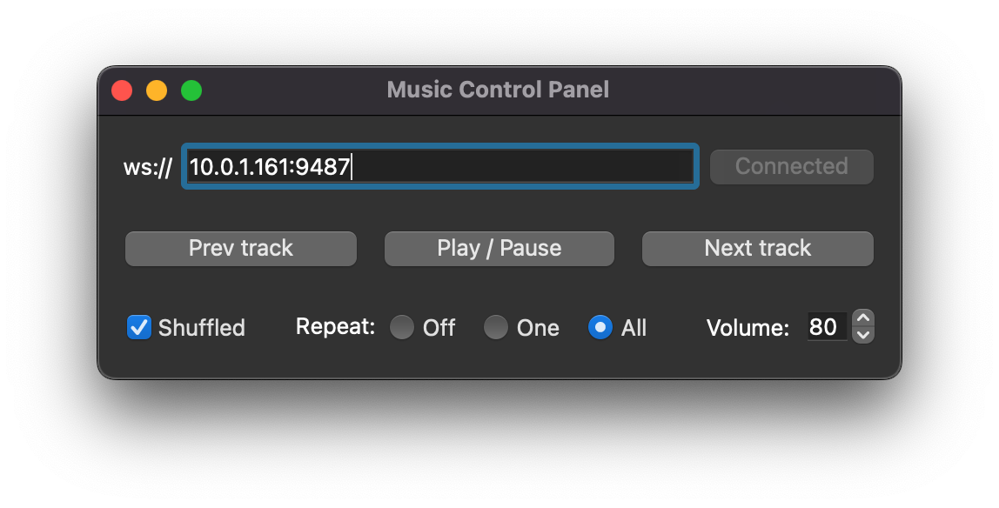

# 透過 WebSocket 控制 macOS Music app


## macOS 端

- 安裝 [Python](https://www.python.org/downloads/)。
- 安裝所需的套件：
    ```
    $ pip3 install websockets
    ```
- 執行 service 程式：
    ```
    $ python3 music_control_service.py
    ```


## 控制端

- 安裝 [Python](https://www.python.org/downloads/)（需要 Python 3.10 以上的版本）。
- 安裝所需的套件：
    ```
    $ pip3 install websocket-client
    $ pip3 install pyside6
    ```
- 執行 control panel 程式：
    ```
    $ python3 control_panel.py
    ```



